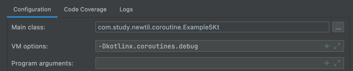

### 코루틴 동작방식

> 코루틴 빌더에서 의해 코루틴이 만들어지고 만들어진 블록 안에서 코루틴이 실행된다.

- 코루틴은 가볍다. (경량쓰레드)

### 코루틴 빌더

> 코루틴을 만들어서 로직을 실행시키는 도구이다.

- 내부적으로 코루틴을 만들어서 반환한다.
- 빌더를 사용하기 위해서는 코루틴 Scope가 필요하다.
    - **즉 코루틴은 코루틴 스코프가 있어야 실행이 가능하다.**
- ex) `launch`, `runBlocking`
- 따라서 runBlocking은 내부에서 CoroutineScope를 만들고 (`GlobalScope.newCoroutineContext(context)`) 이 scope의 확장함수로 launch를 사용할 수 있는
  것이다.

```kotlin
// launch 함수
public fun CoroutineScope.launch(   //  launch는 독립적으로 실행된게 아니다. scope의 함수이기 때문에 scope가 꼭 있어야 한다.
    context: CoroutineContext = EmptyCoroutineContext,
    start: CoroutineStart = CoroutineStart.DEFAULT,
    block: suspend CoroutineScope.() -> Unit
): Job {
    val newContext = newCoroutineContext(context)
    val coroutine = if (start.isLazy)
        LazyStandaloneCoroutine(newContext, block) else
        StandaloneCoroutine(newContext, active = true)
    coroutine.start(start, coroutine, block)
    return coroutine
}

// runBlocking 함수
public fun <T> runBlocking(context: CoroutineContext = EmptyCoroutineContext, block: suspend CoroutineScope.() -> T): T


fun main() {
    // 이렇게 쓰면 launch를 쓰는 이유가 없다.
    // runBlocking 에서 해당 로직들이 다 끝날 때까지 쓰레드를 block하고 있기 때문에 동기와 다를바가 없다.
    runBlocking {
        println(this::class.java)   // class kotlinx.coroutines.BlockingCoroutine
        launch {    // runBlocking에서 만든 BlockingCoroutine을 통해 아래 로직이 실행된다. BlockingCoroutine 은 CoroutineScope를 상속받은 친구다.
            delay(1000L)
            println("Done!")
        }
    }
}

fun main() {
    // 이렇게 쓰면 launch를 쓰는 이유는 생기지만 Main 쓰레드가 종료되면 로직이 중간에 끊기게 된다.
    // runBlocking 과 launch의 scope가 다르기 때문에 각각 독립적으로 실행된다.
    runBlocking {
        println(this::class.java)   // class kotlinx.coroutines.BlockingCoroutine
        GlobalScope.launch {
            println(this::class.java) // class kotlinx.coroutines.StandaloneCoroutine
            delay(1000L)
            println("Done!")
        }
        delay(500L)
    }
}


```

**coroutineScope**

- CoroutineScope
- GlobalScope (프로그램의 라이프타임 전체범위)

### 일시 중단함수

- suspend
- delay
- join

### structured concurrency

- job들을 관리하지 않아도 (ex. join) 여러코루틴들을 기다려준다.

### coroutine의 동작방식

> Continuation Passing Style

- continuation은 callback 같은 것이다. 재개해주는 역할을 갖는 인터페이스
- 재개할 때 continuation.resume()
- resume은 자기자신(같은 함수)를 다시 호출하는 역할을 갖는다.
- `label`: 재개할 때 어디로 가야할지에 대한 정보를 담고있는 변수
- `result`: 로직이 실행되면서 저장해두고 있어야 하는 데이터를 담고 있는 변수

### Coroutine Scope

> 코루틴이 실행할 수 있는 환경을 만드는 것

- coroutine scope는 coroutine context를 담고 있다.
- coroutine scope에서 코루틴이 실행되며 취소(중단)된다.

### Coroutine Context

> coroutine을 실행(동작)하기 위한 환경들에 대한 정보

- ex) 어떤 쓰레드에서 실행할지 -> Dispatcher
- 어떤 동작을 할지 -> Job

**설정요소**

- Job, Dispatcher 등 -> Job, Dispathcer가 coroutine context에 저장된다.

### Dispatcher

> 코루틴이 어떤쓰레드나 어떤 쓰레드풀에서 실행시킬지 결정하는 역할

- 코루틴빌더들은 coroutineContext를 파라미터로 갖고 있다.
    - 이때 어떤 디스패처를 사용할지 이 파라미터에 전달하는 것이다.

### Job

- Job은 부모-자식관계가 있다. (구조적 동시성 참고)
- 부모가 cancel되면 자식도 cancel된다.
- 부모 코루틴은 모든 자식 코루틴들이 끝날때 까지 기다려준다.

### coroutine 디버깅 하는법 (어떤 코루틴에서 실행됐는지 보고 싶을 때)

> Jvm option에 -Dkotlinx.coroutines.debug 를 추가

