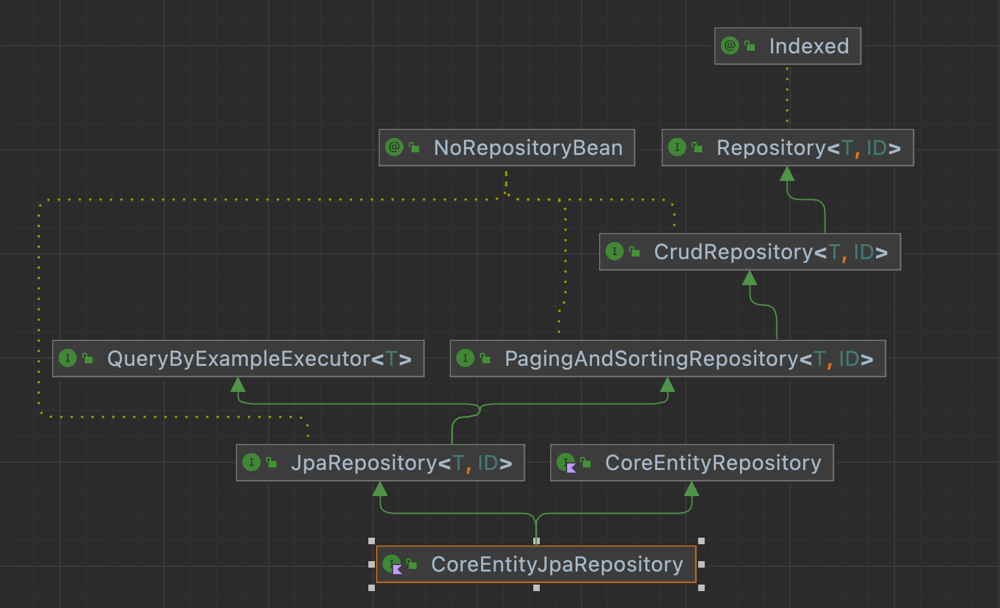

Repository를 만들 때 `CoreEntityRepository: JpaRepository<CoreEntity, Long>` 을 하게 되면 테스트 하기 가 어렵다. 그 이유는 다음과 같다.

- 테스트 할 때 repository 관련 코드가 나올 때마다 mocking 해줘야 한다.
- CoreEntityRepository의 Fake를 만든다 해도 상속받은 시그니처들을 모두 implement(구현) 해야 하기 때문에 쓰이지 않는 함수도 다 구현해야하는 번거로움이 있다.

따라서 테스트를 쉽게 하기 위해선 JpaRepository가 아닌 다른 환경(성격)의 Repository가 필요하다. 즉 프로덕션과 테스트쪽의 CoreEntityRepository의 구현체를 달리해야한다.

- CoreEntityRepository: 클라이언트(사용하는 쪽)에서 쓰일 repository
    - CoreEntityJpaRepository,FakeCoreEntityRepository 가 이 interface를 상속한다.
    - 프로덕션 환경에서는 CoreEntityJpaRepository가 테스트 환경에서는 FakeCoreEntityRepository가 쓰여서 다형성을 이용해 코드 변경없이 다른 환경을 구축할 수 있다.
- CoreEntityJpaRepository
    - 
- FakeCoreEntityRepository

다만 CoreEntityRepository 는 이제 JpaRepository를 상속받고 있지 않기 때문에 기존에 상속받아서 쓰고 있던 save, findById 등을 정의해줘야 한다.

```kotlin
interface CoreEntityRepository {
    fun <S : CoreEntity> save(entity: S): S
    fun <S : CoreEntity> saveAll(entities: Iterable<S>): MutableList<S>
}
```

### 비하인드

CoreEntityRepository에는 `@Repository`를 붙이지 않았는데 프로덕션 환경에서 알아서 CoreEntityJpaRepository 가 들어갔다.

어떻게 된 것인가 살펴보니, 프로덕션에서는 현재 CoreEntityRepository 타입의 빈이 CoreEntityJpaRepository가 있기 때문이다.

CoreEntityJpaRepository에도 `@Repository`가 없지만 JpaRepository의 구현체인 SimpleJpaRepository가 빈으로 등록되기 때문에
CoreEntityJpaRepository도 빈으로 등록된 것이다.

```kotlin
@Repository
@Transactional(readOnly = true)
public class SimpleJpaRepository<T, ID> implements JpaRepositoryImplementation < T, ID > 
```

