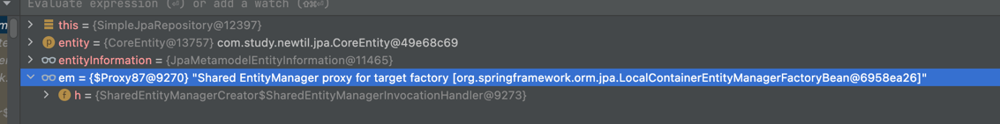
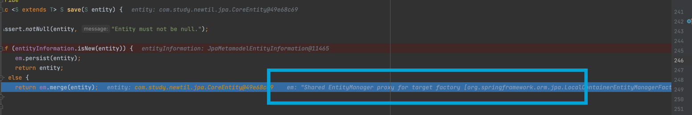

## Persist와 Merge의 차이

### Persist

> 최초생성된 Transient 상태의 entity를 영속화 하는데 사용

### Merge

> Detached 상태의 Entity를 다시 영속화 하는데 사용

## SimpleJpaRepository.save 동작과정 파헤치기

```kotlin
// SimpleJpaRepository
@Transactional
@Override
public < S extends T > S save (S entity) {

    Assert.notNull(entity, "Entity must not be null.");

    /**
     * JpaMetamodelEntityInformation.isNew(entity)
     * 만약 엔티티가 Persistable을 상속받았다면 다른 구현체를 타게 된다.
     */
    if (entityInformation.isNew(entity)) {
        em.persist(entity); // 여기서 em은 SharedEntityManagerCreator - SharedEntityManagerInvocationHandler (proxy)
        return entity;
    } else {
        return em.merge(entity);
    }
}

// JpaMetamodelEntityInformation
// entityInformation.isNew
@Override
public boolean isNew(T entity) {

    if (!versionAttribute.isPresent()
        || versionAttribute.map(Attribute::getJavaType).map(Class::isPrimitive).orElse(false)
    ) {
        return super.isNew(entity);  // JpaMetamodelEntityInformation.isNew(entity)
    }
}

// JpaMetamodelEntityInformation
// super.isNew
public boolean isNew(T entity) {

    ID id = getId (entity);
    Class<ID> idType = getIdType ();

    if (!idType.isPrimitive()) {
        return id == null;
    }

    if (id instanceof Number) {
        return ((Number) id).longValue() == 0L;
    }

    throw new IllegalArgumentException (String.format("Unsupported primitive id type %s!", idType));
}


```

- em은 proxy(SharedEntityManagerCreator)로 되어있다.
  
  
    - 따라서 em.merge() / em.persist() 할 때 SharedEntityManagerCreator 의 invoke를 먼저 하고 각 method에 따라 실제 method를 실행한다.


## getId 가져오는 방식