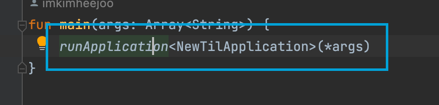
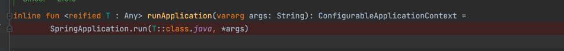
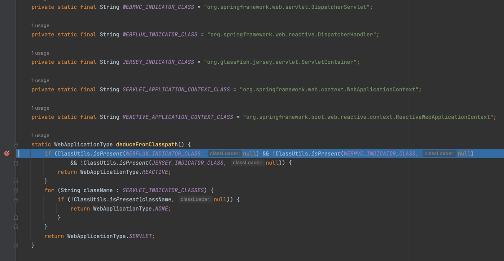
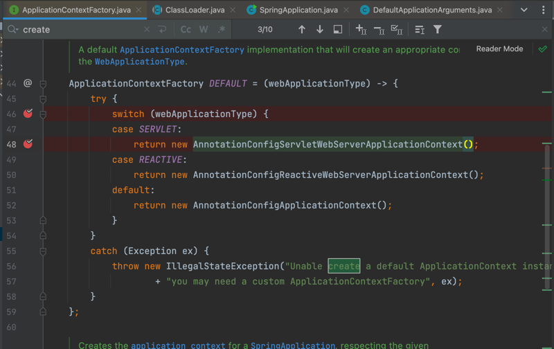
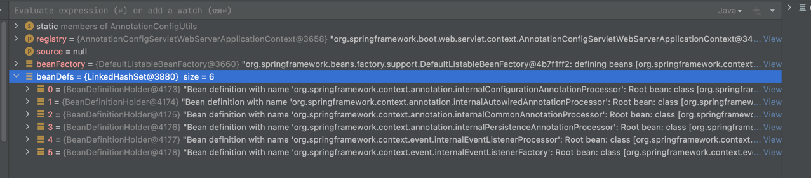

## 어플리케이션 띄울때 실행과정

### 1. 최초실행



### 2. runApplication함수의 실제코드 -> SpringApplicationExtensions.kt



### 3. SpringApplication.run 호출 부 -> SpringApplication.java

> 여기서 `SpringApplication` 초기화 & run

### SpringApplication 초기화

- `this.webApplicationType = WebApplicationType.deduceFromClasspath();`
    - classPath(의존성)에 따라 WebApplicationType을 결정한다.
    - 추후에 webApplicationType에 따라 applicationContext의 타입이 결정된다.
      
    - NONE: REACTIVE 도 아니고 SERVLET(Web)도 아닌 케이스 -> 배치, 컨슈머

### SpringApplication run

여기서 리스너도 초기화 -> getRunListeners 함수

- SpringApplicationRunListeners 에 EventPublishingRunListeners이 들어있음
- 리스너에 어플리케이션서버 정보를 연결? `listeners.starting(bootstrapContext, this.mainApplicationClass)`

**createApplicationContext 함수**

- context 초기화
- applicationContextFactory (DEFAULT) 에서 생성
- webApplicationType이 SERVLET이라 ApplicationFactory는 `AnnotationConfigServletWebServerApplicationContext`
    - 
    - 
    - 따라서 SpringApplication의 applicationContextFactory필드는 AnnotationConfigServletWebServerApplicationContext 타입이 되는
      것

```java
// AnnotationConfigServletWebServerApplicationContext.java

public AnnotationConfigServletWebServerApplicationContext(){
        this.reader=new AnnotatedBeanDefinitionReader(this);
        this.scanner=new ClassPathBeanDefinitionScanner(this);
        }
```

- AnnotatedBeanDefinitionReader 생성시 BeanDefinition을 만들어 registry에
  등록한다. `AnnotationConfigUtils.registerAnnotationConfigProcessors(this.registry)`

```java
public AnnotatedBeanDefinitionReader(BeanDefinitionRegistry registry,Environment environment){
        Assert.notNull(registry,"BeanDefinitionRegistry must not be null");
        Assert.notNull(environment,"Environment must not be null");
        this.registry=registry;
        this.conditionEvaluator=new ConditionEvaluator(registry,environment,null);
        AnnotationConfigUtils.registerAnnotationConfigProcessors(this.registry);    // 여기서 BeanDefinition 등록
        }
```

- 이 친구들이 등록되는 듯?
  

**prepareContext 함수**

- postProcessApplicationContext함수
    - context의 beanFactory에서 setConversionService을 한다??
        - getBeanFactory -> GenericApplicationContext의 beanFactory (DefaultListableBeanFactory)
- load 함수
    - BeanDefinitionLoader 생성 -> createBeanDefinitionLoader 함수
        - source 배열에 있는 클래스를 annotationReader 필드애 등록 (source: [NewTilApplication])
- callRunners 함수
    - ApplicationRunner 클래스타입의 빈들을 ruuners에 추가 (ApplicationRunner 안만들었으면 아무것도 들어가지 않음)
    - CommandLineRunner 클래스타입의 빈들을 ruuners에 추가 (CommandLineRunner 안만들었으면 아무것도 들어가지 않음)
    - runners에 있는 원소들 실행

[//]: # (todo)
**refreshContext 함수**

- 여기서 실질적인 bean 만들어줌??
- getBean해와서..
- refresh -> 언제 호출된거지
    - applicationContext.refresh()
        - ServletWebServerApplicationContext.java의 refresh 함수
        - super를 호출해서 AbstractApplicationContext에서 실행