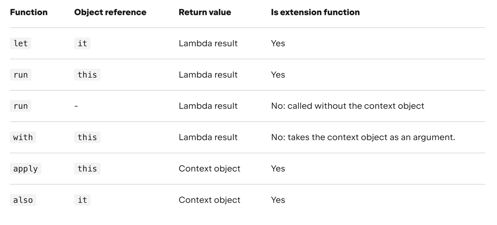

## Scope Function

### scope function 의 정의

> 객체 안에 범위를 만들어서 코드를 실행시킬 수 있게하는 (람다?)함수
>
> 예) also, apply, let, run, with
>

### scope function의 특징

- scope function을 사용하면 임시로 코드가 실행되는 범위가 형성되며, 이 안에서 객체의 정보를 조금 더 간결하게 사용할 수 있다.
    - 가령, 객체의 특정 프로퍼티를 객체이름 없이 엑세스가 가능하다.
    - 즉 코드가 간결해서 읽기 쉽다. 그러므로 객체관련해서 어떤 코드가 실행되어야 할 때 유용하다.
  ```kotlin
  data class Person(val name: String)

  fun main() {
    val person = Person("heejoo")
    person.run { 
        println(name)
    }

  }
  ```

### scope function을 선택하는 기준

> The choice mainly depends on your intent and the consistency of use in your project.

- 어떤의도로 만들어진 것인지, 어떤 일관성(?)을 갖는지에 따라 scope function을 결정하면 된다.

 출처. kotlin docs

### let

```kotlin
public inline fun <T, R> T.let(block: (T) -> R): R
```

- 객체의 확장함수로, 람다의 반환값이 return 된다.
- null 이 아닌 객체를 이용해서 **어떤 로직을 실행시킬 때** 사용하면 좋다.


- 예제

```kotlin
data class Person(val name: String, val age: Int)

fun main() {
    val person = Person("heejoo", 28)
    val introduceComment = person.let {
        "안녕, 나는 ${it.age}세 ${it.name} 라고 해"
    }

    println(introduceComment)
}
```

### run (작성중)

```kotlin
public inline fun <T, R> T.run(block: T.() -> R): R
```

```kotlin
public inline fun <R> run(block: () -> R): R
```

```kotlin
data class Person(val name: String)

fun main() {
    val person = Person("heejoo")
    person.run {

    }

    kotlin.run { }
}
```

### context object: this / it

- this: lambda receiver  (람다 수신자) 로 객체 정보 접근
- it: lambda argument (람다 인자) 로 객체 정보 접근

```kotlin
fun main() {
    val str = "String"
    str.run {
        println("$this length: $length")
    }

    str.let {
        println(it.length)
    }
}
```

**this**

- run, with, apply
- `this.변수명`, `this.함수명()` 이렇게 사용가능하고 심지어 this 생략가능하다.
- 하지만 this를 생략하면 외부 함수와 object context의 함수와 헷갈릴 가능성이 높다.
    - 따라서 컨텍스트 객체를 수신자(this)로 사용하는 것은 **주로 객체 멤버에서 작동하는 람다(해당 기능 호출 또는 속성 할당)에 권장**된다.

```kotlin
fun main() {
    val person = Person("heejoo")
    person.run {
        println(introduce() + name) // introduce는 Person 클래스에 정의된 함수가 아닌데 그렇게 해석 될 여지가 있다.
    }
}

fun introduce(): String = "hi"

data class Person(val name: String)
```

**it**

- let, also
- 이름을 딱히 짓지 않으면 디폴트 `it`으로 접근한다. (이름 지정가능)
- this 와 달리 생략이 불가능하다.
- 코드블록에서 여러 변수들이 사용될때 좋다... (왜?)

```kotlin
fun getRandomInt(): Int {
    return Random.nextInt(100).also { it ->
        writeToLog("getRandomInt() generated value $it")
    }
}
```

### Return value

- **context object를 반환: apply, also**
    - **함수체이닝이 가능하다.**

```kotlin
val numberList = mutableListOf<Double>()

numberList
    .also { println("Populating the list") }
    .apply {
        add(2.71)
        add(3.14)
        add(1.0)
    }
    .also { println("Sorting the list") }
    .sort()

```

- **lambda 식의 반환값을 반환: let, run, with**
    - 람다식의 결과를 변수에 넣고 결과에 관한 다음 작업을 할 때 유용하다.

```kotlin
val numbers = mutableListOf("one", "two", "three")
val countEndsWithE = numbers.run {
    add("four")
    add("five")
    count { it.endsWith("e") }
}
println("There are $countEndsWithE elements that end with e.")
```

- lambda result 값을 무시하고 void 형식으로도 사용이 가능하다.

```kotlin
val numbers = mutableListOf("one", "two", "three")
with(numbers) {
    val firstItem = first()
    val lastItem = last()
    println("First item: $firstItem, last item: $lastItem")
}
```